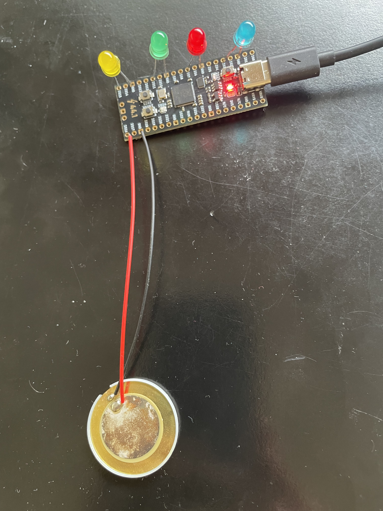

# BwInf Ergebnisse mit Orpheus Pico

Dieses Projekt sendet regelmäßig eine Anfrage, ob die Ergebnisse der zweiten Runde des 44. Bundeswettbewerbs Informatik schon veröffentlicht wurden und zeigt dies am Orpheus Pico durch LED und eine Melodie an.

# Vorraussetzungen

- Orpheus Pico
- Computer
- USB-Kabel zwischen Pico und Computer
- 4 LEDs (gelb, grün, rot, blau)
- Piezo

Auf dem Pico sollte Micropython installiert sein.

# Installation

## Aufbau

Die Bauteile sollten wie auf dem Bild angeschlossen werden (kurze Seite der LEDs / schwarzes Kabel des Piezo an `GND`):
- gelbe LED: `I015`
- grüne LED: `I011`
- rote LED: `I07`
- blaue LED: `I03`
- Piezo: `I016`

Der Pico muss mit dem Computer über ein USB-Kabel verbunden sein.

## Pico

Über Thonny sollen folgende Dateien auf den Pico übertragen werden:

- [Ergebnisse.py](Pico/Ergebnisse.py)
- [main.py](Pico/main.py)
- [Sound.py](Pico/Sound.py)

Anschließend muss Thonny geschlossen werden, damit der Datenaustausch zwischen Pico und Computer nicht gestört wird.
Die `main.py` Datei wird automatisch beim Start des Pico ausgeführt.

## Computer

Auf dem Computer muss diese Datei im Terminal ausgeführt werden:
[Computer/Ergebnisse.py](Computer/Ergebnisse.py)

Es wird nach der URL des Logins gefragt, sodass der Code auf das eigene Ergebnis zugreifen kann.
Die URL sollte in etwa so aussehen:\
`https://login.bwinf.de/app/PMS/1/wo/.../1.0.0.27.5.0`

# Funktionsweise

Wenn der Pico gestartet wird, leuchten alle LEDS und zwei hohe Töne erklingen.
Steht die Verbindung mit dem Computer, erlischen alle LEDs und ein aufsteigender Dreiklang wird abgespielt.

Danach werden in regelmäßigen Abständen (alle zwei Minuten) Anfragen gesendet.
Die LEDs und Töne haben folgende Bedeutungen:

- Gelbe LED blinkt für 5 Sekunden: Die Ergebnisse sind noch nicht veröffentlicht, alles wie bisher
- Grüne LED leuchtet (Melodie: "Alle Vögel sind schon da"): Du bist weitergekommen! Herzlichen Glückwunsch!
- Rote LED leuchtet (Melodie: "Alle Vögel sind schon da" in Moll): Du bist leider nicht weritergekommen.
- Blaue LED blinkt einmal pro Sekunde (Melodie: e, d, c, d, e): Der Login ist nicht mehr gültig. Melde dich nochmal an und gib den Link in Terminal (wo der Python Code läuft) ein.
- Blaue LED blinkt fünfmal pro Sekunde (Melodie: zwei tiefe Töne): Irgendein unbekannter Fehler ist aufgetreten
- Alle LEDs leuchten (Melodie: zwei hohe Töne): Der Pico kann den Computer nicht erreichen (siehe oben unter Funktionsweise)